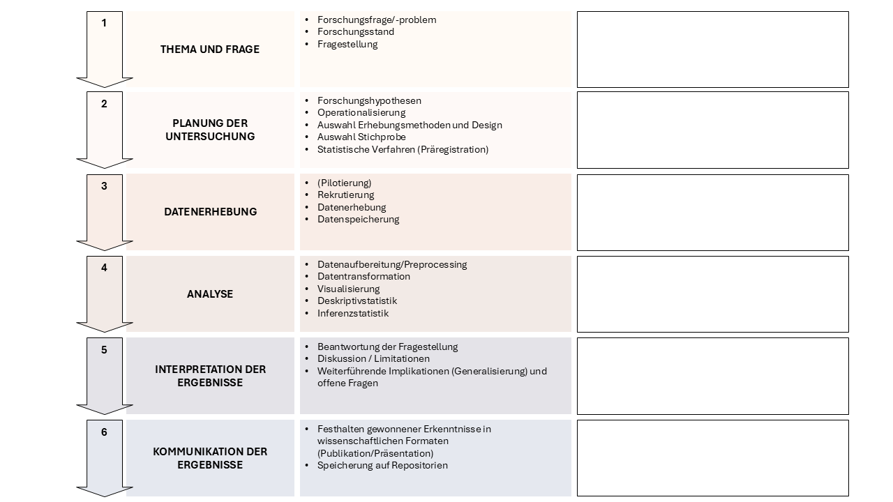

# Complab im Forschungsprozess

Der Begriff _Computerlab_ bezieht sich auf die Arbeit, die Neurowissenschaftler:innen an Computern oder anderen elektronischen Geräten durchführen, um neurowissenschaftliche Forschungsfragen zu beantworten.
Jede Forschungsarbeit hat mehrere Phasen, welche ganz unterschiedliche Anforderungen stellen.

In jeder Phase des Forschungsprozesses werden verschiedenste 

- elektronische Geräte (Computer, Eyetracker, EEG-Geräte, MRTs, etc.)
- Programme (PsychoPy, E-Prime, etc.)
- Programmiersprachen (R, MATLAB, Python, Java, C++, Ruby, Julia, etc.)
- Skripte, Datensätze, etc.

verwendet.

In diesem Kurs werden wir einige Stationen dieses Forschungsprozesses gemeinsam bearbeiten, um Einblick in das neurowissenschaftliche Arbeiten zu erhalten.
